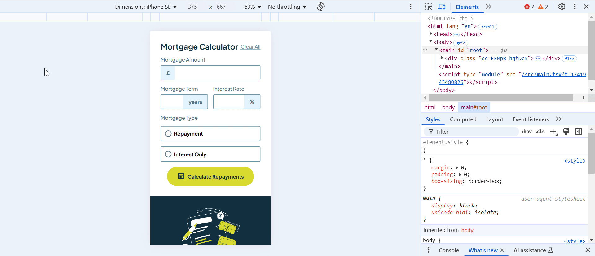

# Frontend Mentor - Mortgage repayment calculator solution

This is a solution to the [Mortgage repayment calculator challenge on Frontend Mentor](https://www.frontendmentor.io/challenges/mortgage-repayment-calculator-Galx1LXK73). Frontend Mentor challenges help you improve your coding skills by building realistic projects.

## Table of contents

- [Overview](#overview)
  - [The challenge](#the-challenge)
  - [Screenshot](#screenshot)
  - [Links](#links)
- [My process](#my-process)
  - [Built with](#built-with)
  - [What I learned](#what-i-learned)
  - [Continued development](#continued-development)
  - [Useful resources](#useful-resources)
- [Author](#author)

## Overview

### The challenge

Users should be able to:

- Input mortgage information and see monthly repayment and total repayment amounts after submitting the form
- See form validation messages if any field is incomplete
- Complete the form only using their keyboard
- View the optimal layout for the interface depending on their device's screen size
- See hover and focus states for all interactive elements on the page

### Screenshot



### Links

- Solution URL: [Github](https://github.com/snigdha-sukun/mortgage-repayment-calculator)
- Live Site URL: [Vercel](https://mortgage-repayment-calculator-two-blush.vercel.app/)

## My process

### Built with

- [React](https://reactjs.org/) - JS library
- [Styled Components](https://styled-components.com/) - For styles

### What I learned

I learned how to hide the arrows for `<input type ="number">`:

```ts
export const Input = styled.input`
    width: 100%;
    font-size: 1rem;
    padding: 0.75rem;
    border: none;
    cursor: pointer;

    &:focus, &:hover {
        outline: none;
    }

    &[type='number'] {
    -moz-appearance: textfield; /* Firefox */
    &::-webkit-inner-spin-button,
    &::-webkit-outer-spin-button {
      -webkit-appearance: none; /* Safari and Chrome */
      margin: 0;
    }
  }
`;
```

I learned how to use `:focus-within` to style the parent element when a child element is focused:

```ts
export const InputWrapper = styled.div<{ showError: boolean }>`
    position: relative;
    width: 100%;
    display: flex;
    flex-direction: row;
    border: 0.15rem solid ${({ theme, showError }) => showError ? theme.colors.red : theme.colors.slate500};
    border-radius: 0.25rem;
    cursor: pointer;

    &:focus-within {
    border-color: ${({ theme }) => theme.colors.lime};
  }

  &:hover {
        border-color: ${({ theme }) => theme.colors.slate900};
    }
`;
```

I learned how to create prefix & suffix for the input field:

```ts
export const InputAdornment = styled.span<{showError: boolean}>`
    position: relative;
  height: auto;
  width: auto;
  display: flex;
  justify-content: center;
  align-content: center;
  align-items: center;
  flex-direction: column;
  background-color: ${({ theme, showError }) => showError ? theme.colors.red : theme.colors.slate100};
  color: ${({ theme, showError }) => showError ? theme.colors.white : theme.colors.slate700};
  font-weight: ${({ theme }) => theme.fontWeights.bold};
  white-space: nowrap;
  flex-shrink: 0;
  padding: 0 1rem;

  ${InputContainer}:focus-within & {
    background-color: ${({ theme }) => theme.colors.lime};
    color: ${({ theme }) => theme.colors.slate900};
  }
`;
```

I learned how to style a radio input:

```ts
export const StyledRadioInput = styled.input`
  accent-color: ${({ theme }) => theme.colors.lime};
  border: 0px;
  width: 1.25rem;
  height: 1.5em;
  cursor: pointer;
  appearance: none;
  border-radius: 50%;
  border: 0.15rem solid ${({ theme }) => theme.colors.slate700};
  position: relative;
  display: flex;
  align-items: center;
  justify-content: center;

  &::after {
    content: '';
    width: 0.8rem;
    height: 0.8rem;
    background-color: ${({ theme }) => theme.colors.lime};
    border-radius: 50%;
    opacity: 0; /* Hidden by default */
    transition: opacity 0.2s ease-in-out;
  }

  &:checked {
    border-color: ${({ theme }) => theme.colors.lime};
    }

  &:checked::after {
    opacity: 1;
  }

   &:checked + ${RadioLabel} {
    background-color: ${({ theme }) => theme.colors.lime};
  }
`;
```

### Continued development

I would continue practicing the use of React Context & Providers and using styled-components

### Useful resources

- [How to remove the arrows from input[type="number"]](https://stackoverflow.com/a/22306944) - This helped me hide the spin-box/arrows in the number input.
- [Input Sufix Prefix](https://codesandbox.io/p/sandbox/input-sufix-prefix-nz198) - This helped me add the input adornment needed for the number inputs.

## Author

- Frontend Mentor - [@snigdha-sukun](https://www.frontendmentor.io/profile/snigdha-sukun)
